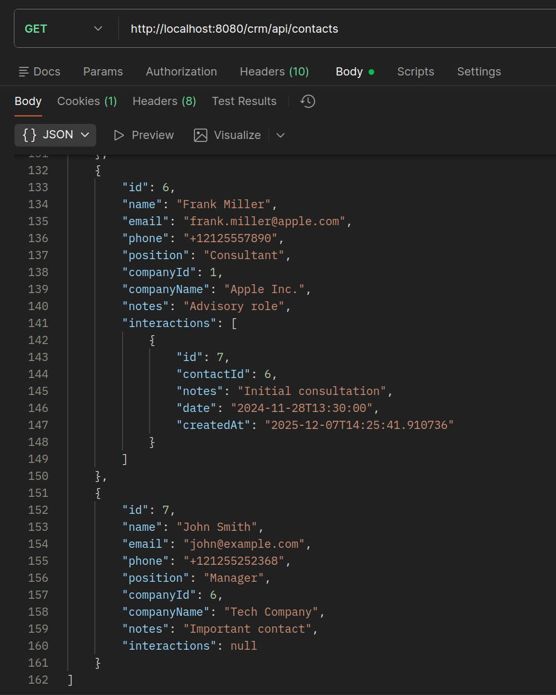

# Contact Management CRM Lite

**Управление контактами** - Spring Boot приложение для управления контактами, компаниями и журналом взаимодействий.

## Требования

- Java 21+
- Maven 3.6+

## API Endpoints

### Контакты (Contacts)

| Метод | Endpoint | Описание |
|-------|----------|---------|
| POST | `/api/contacts` | Создать новый контакт |
| GET | `/api/contacts` | Получить все контакты |
| GET | `/api/contacts/{id}` | Получить контакт по ID |
| GET | `/api/contacts/search?query=xxx` | Поиск контактов по имени/email/телефону |
| GET | `/api/contacts/company/{companyId}` | Получить контакты компании |
| PUT | `/api/contacts/{id}` | Обновить контакт |
| DELETE | `/api/contacts/{id}` | Удалить контакт |

### Компании (Companies)

| Метод | Endpoint | Описание |
|-------|----------|---------|
| POST | `/api/companies` | Создать новую компанию |
| GET | `/api/companies` | Получить все компании |
| GET | `/api/companies/{id}` | Получить компанию по ID |
| PUT | `/api/companies/{id}` | Обновить компанию |
| DELETE | `/api/companies/{id}` | Удалить компанию |

### Взаимодействия (Interactions)

| Метод | Endpoint | Описание |
|-------|----------|---------|
| POST | `/api/interactions/contact/{contactId}` | Создать запись о взаимодействии |
| GET | `/api/interactions/{id}` | Получить запись по ID |
| GET | `/api/interactions/contact/{contactId}` | Получить историю взаимодействий контакта |
| PUT | `/api/interactions/{id}` | Обновить запись |
| DELETE | `/api/interactions/{id}` | Удалить запись |

## Установка и запуск

### 1. Клонирование репозитория

```bash
git clone https://github.com/lzimin05/contact_management.git
cd contact_management
```

### 2. Сборка проекта

```bash
mvn clean package
```

### 3. Запуск приложения

```bash
mvn spring-boot:run
```

Приложение будет доступно по адресу: `http://localhost:8080/crm`

H2 Console: `http://localhost:8080/crm/h2-console`
- JDBC URL: `jdbc:h2:mem:testdb`
- Username: `sa`
- Password: (оставить пустым)

### 4. Инициализация БД

**База данных инициализируется автоматически при запуске приложения.**

SQL скрипт `src/main/resources/data.sql` автоматически загружает тестовые данные:
- ✅ 5 компаний (Apple, Microsoft, Google, Samsung, Tesla)
- ✅ 6 контактов с уникальными email и телефонами
- ✅ 7 записей о взаимодействиях

Тестовые пользователи добавляются сразу при первом запуске — можно сразу начинать работать с API.

## Примеры использования

### Создание контакта

```bash
curl -X POST http://localhost:8080/crm/api/contacts \
  -H "Content-Type: application/json" \
  -d '{
    "name": "John Smith",
    "email": "john@example.com",
    "phone": "+12125552368",
    "position": "Manager",
    "companyId": 1,
    "notes": "Important contact"
  }'
```

### Поиск контактов

```bash
curl http://localhost:8080/crm/api/contacts/search?query=John
```

### Создание компании

```bash
curl -X POST http://localhost:8080/crm/api/companies \
  -H "Content-Type: application/json" \
  -d '{
    "name": "Tech Company",
    "industry": "Technology",
    "website": "https://example.com",
    "address": "San Francisco, CA"
  }'
```

### Добавление записи о взаимодействии

```bash
curl -X POST http://localhost:8080/crm/api/interactions/contact/1 \
  -H "Content-Type: application/json" \
  -d '{
    "notes": "Discussed partnership",
    "date": "2024-12-05T14:30:00"
  }'
```

### Просмотр всех контактов



### Примеры ошибок

**Ошибка валидации (400):**
```json
{
  "message": "Ошибка валидации данных",
  "timestamp": "2025-12-07T10:30:00",
  "errors": {
    "email": "Некорректный формат email",
    "name": "Имя контакта обязательно"
  }
}
```

**Ошибка уникальности (409):**
```json
{
  "message": "Телефон уже используется другим контактом",
  "timestamp": "2025-12-07T10:30:00"
}
```

## Тестирование

Запуск тестов:

```bash
mvn test
```

## Структура проекта

```
src/
├── main/
│   ├── java/com/crm/
│   │   ├── entity/         # JPA сущности
│   │   │   ├── Contact.java
│   │   │   ├── Company.java
│   │   │   └── Interaction.java
│   │   ├── repository/     # Data Access Objects
│   │   │   ├── ContactRepository.java
│   │   │   ├── CompanyRepository.java
│   │   │   └── InteractionRepository.java
│   │   ├── service/        # Бизнес-логика
│   │   │   ├── ContactService.java
│   │   │   ├── CompanyService.java
│   │   │   └── InteractionService.java
│   │   ├── controller/     # REST API
│   │   │   ├── ContactController.java
│   │   │   ├── CompanyController.java
│   │   │   └── InteractionController.java
│   │   ├── dto/           # Data Transfer Objects
│   │   │   ├── ContactDTO.java
│   │   │   ├── CompanyDTO.java
│   │   │   └── InteractionDTO.java
│   │   └── exception/     # Обработка ошибок
│   │       ├── GlobalExceptionHandler.java
│   │       └── ErrorResponse.java
│   └── resources/
│       ├── application.properties
│       └── data.sql
└── test/
    └── java/com/crm/
        ├── service/
        │   └── ContactServiceTest.java
        └── controller/
            └── ContactControllerTest.java
```

## Автор

**Зимин Леонид** - lzimin05
